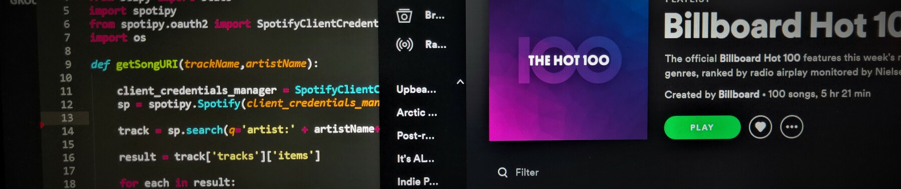

    
# The Spotify Hit Predictor Dataset (1960-2019)

This repository contains the aproachment to a model to treat the Spotify
hit predictor dataset from [theoverman](https://www.kaggle.com/theoverman) at [Kaggle](https://www.kaggle.com/theoverman/the-spotify-hit-predictor-dataset)

This dataset contains over 40,000+ Tracks labeled hit or flop, with their features extracted from the Spotify Sound Analysis API.

The repository holds the source code of the website https://hitornot.ml/ develop by myself, which uses the model deployed here to simply let you search if your future song will be a hit!


## Features

- Prediction of a song being flop or a hit based on song data such as danceability or song energy! At the time of writing this down, it has this rendiment metrics:
    
| Metric Name | Value |
| ------------- | ------------- |
| Accuracy | Contenido de la celda  |
| Precision  | Contenido de la celda  |
| Recall  | Contenido de la celda  |
| F1 Score  | Contenido de la celda  |
        
- The website saves the song you search as input data to retrain the model itself so it learns by user new input as well!
- Jupyter notebook inside with an explanation of the Dataset and my current aproachment to it with an stadistic model!
## Folder Structure

- Src contains the model code
- Deploy contains the website code
- Jupyter Notebook available at root folder.
## Run Locally

Clone the project

```bash
  git clone https://github.com/elblogbruno/MD3-Kaggle-Spotify-Hit-Detector
```

Go to the project directory

```bash
  cd MD3-Kaggle-Spotify-Hit-Detector
```

Install dependencies

```bash
  python -m pip install -r requirements.txt
```

Start the server

```bash
  cd deploy && python app.py
```

  
## Tech Stack

**Client:** Plain CSS and HTML, thanks to [@samratcliffe](https://codepen.io/samratcliffe/pen/xOqEZg) 

**Server:** Flask, Jinja2 Templates and SQLAlchemy.

**Model:** Sklearn for model fit and scoring, joblib for deploying the model into the web.

  
## Acknowledgements

 - [@samratcliffe](https://codepen.io/samratcliffe/pen/xOqEZg) for its search design I used on the website.
 - [theoverman](https://www.kaggle.com/theoverman) at [Kaggle](https://www.kaggle.com/theoverman/the-spotify-hit-predictor-dataset) for creating this dataset I really enjoyed working on! I am a music nerd.

## Feedback

If you have any feedback, please reach out me at me@brunomoya.com

  